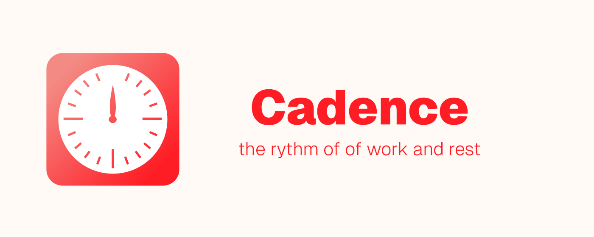

# Cadence - Custom pomodoro timers for focused work and restful breaks



Cadence helps you stay focused with customizable Pomodoro-style timers (work/break cycles).

You can set personalized work and break intervals that match your rhythm and energy levels. Cadence also helps you stay on track with features like project tracking, productivity stats, and daily goals — giving you insight into how you spend your time and helping you build better habits. During focus sessions, you can block distracting websites to maintain momentum and avoid temptation.

Cadence is lightweight, reliable, and intuitive. It never saves, sends, or uses any of your information for purposes other than its core functionality.

## Install Locally (Chrome)

1. Download the latest .zip file version from [https://github.com/Thinkorswim/cadence/releases](https://github.com/Thinkorswim/cadence/releases)
2. Unzip the file and you should have a folder `cadence-chrome`
3. Move the folder to a permanent location on your computer (do not delete the folder after installation).
4. Go to the extensions page: chrome://extensions
5. Enable Developer Mode (toggle "Developer mode" at the top-right corner)
6. Click Load unpacked and select/open the extension folder (contains file manifest.json).


## Developer setup

The project is based on the [WXT Framework](https://wxt.dev/) with Vite and React. To start development or build from source follow the steps below:

1. Download and install Node.js from the [official website](https://nodejs.org/).
2. Clone the repository 

```
git clone https://github.com/Thinkorswim/cadence.git
``` 

3. Install dependencies 

```
cd cadence/Cadence
npm install
```

4. Run the project

```
npm run dev
```

5. (Optional) Create a build from source

```
npm run build
```

This creates a `dist` folder which can be loaded unpacked into your browser extensions. Hot reloading development is available.
